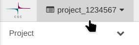
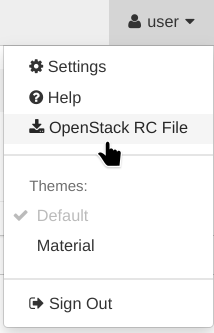

# Bootstrapping Utilities for Supernetes

This repository contains tooling that helps with setting up a [Talos Linux](https://www.talos.dev/) Kubernetes cluster for developing and evaluating [Supernetes](https://github.com/supernetes/supernetes). More specifically, the tools help with

- creating an unprovisioned Talos Linux cluster in [CSC's cPouta](https://research.csc.fi/-/cpouta) OpenStack environment, and
- bootstrapping an unprovisioned Talos Linux cluster using [talos-bootstrap](https://github.com/twelho/talos-bootstrap).

Both steps can be invoked individually, so you don't need to run Talos Linux on cPouta if you just need to bootstrap Supernetes on it.

## Usage

The scripts assume a standard set of tooling that are provided in a container built from this repo. Podman or Docker is required to be present on the host. Build, start and enter the container simply by issuing

```shell
./container
```

For utilities available in the container, please see the [Dockerfile](./Dockerfile). Some tools are also installed during the `Configuration` step.

### Creating a New Cluster in cPouta

<!--suppress CheckImageSize, HtmlDeprecatedAttribute -->


Start by logging into cPouta and selecting the right project from the top left. The project must have sufficient resources available for running VMs.

> [!WARNING]
> Please choose an empty project, all existing resources may be automatically deleted as part of the idempotency!



Then, click on your username from the top right and select `OpenStack RC File`. This will give you a file named `project_1234567-openrc.sh` which will be used by the scripts for API access. Save it into the `work` directory, which is used as the working directory of the container.

Next, since cPouta only hands out ephemeral IPv4 addresses, we need to set up [Dynamic DNS (DDNS)](https://en.wikipedia.org/wiki/Dynamic_DNS) for the cluster. This can be done using external services, such as [dy.fi](https://www.dy.fi/) (Finland-only), or any other service supported by [ddclient](https://ddclient.net/). A configuration template is provided in [`ddclient.template.conf`](work/ddclient.template.conf). Copying this file to `ddclient.conf` and filling it out will set up automatic dynamic DNS reconciliation in the cluster during bring-up.

Finally, inside the [container](#usage), run

```shell
. project_1234567-openrc.sh # Load the configuration, you might need to log in
talosctl gen secrets # Generate Talos secrets (one-time)
./cpouta up # Bring up the VMs
```

The nodes should now be running with the baseline configuration, and ready to be fully configured with `talos-bootstrap`.

> [!IMPORTANT]
> If using dynamic DNS, the cPouta tooling will automatically register the DDNS FQDN as a SAN for the cluster certificate. To preserve access after running `talos-bootstrap`, it must be fed a configuration patch that looks as follows:
> ```yaml
> machine:
>   certSANs:
>     - cluster.example.com # Add DNS FQDN as SAN to cluster cert
>  ```

### Applying Supernetes Configuration with `talos-bootstrap`

The full configuration is applied using [talos-bootstrap](https://github.com/twelho/talos-bootstrap), which is provided as a submodule in this repo.

1. Edit the configuration file [`work/supernetes-cluster.yaml`](work/supernetes-cluster.yaml) and change the path `controlplane/record` to point to the Talos/Kubernetes endpoint address (public IP in case of cPouta).
2. Inside the [container](#usage), run

   ```shell
   bootstrap supernetes-cluster.yaml
   ```

   and wait for the bootstrap process to finish. Your cluster should now be configured with [FluxCD](https://fluxcd.io/) automatically reconciling in the Supernetes controller.

Refer to the documentation of [talos-bootstrap](https://github.com/twelho/talos-bootstrap) for details, such as how to apply patches and additional manifests etc.

> [!IMPORTANT]
> Don't forget to additionally apply the Supernetes controller configuration Secret (see the [configuration section in the Supernetes repository](https://github.com/supernetes/supernetes?tab=readme-ov-file#configuration)) with `kubectl apply -f controller.yaml`.

## Authors

- Dennis Marttinen ([@twelho](https://github.com/twelho))

## License

[MPL-2.0](https://spdx.org/licenses/MPL-2.0.html) ([LICENSE](LICENSE))
